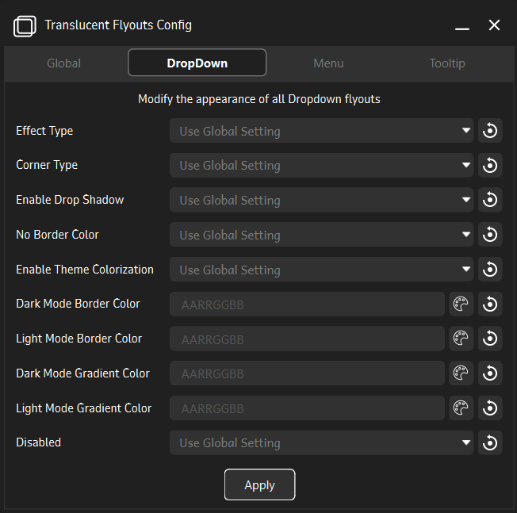
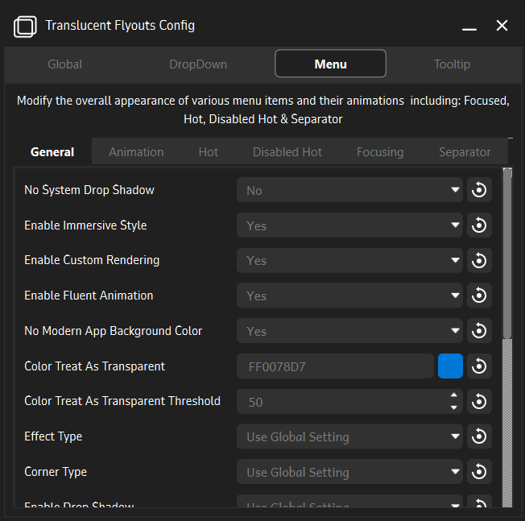
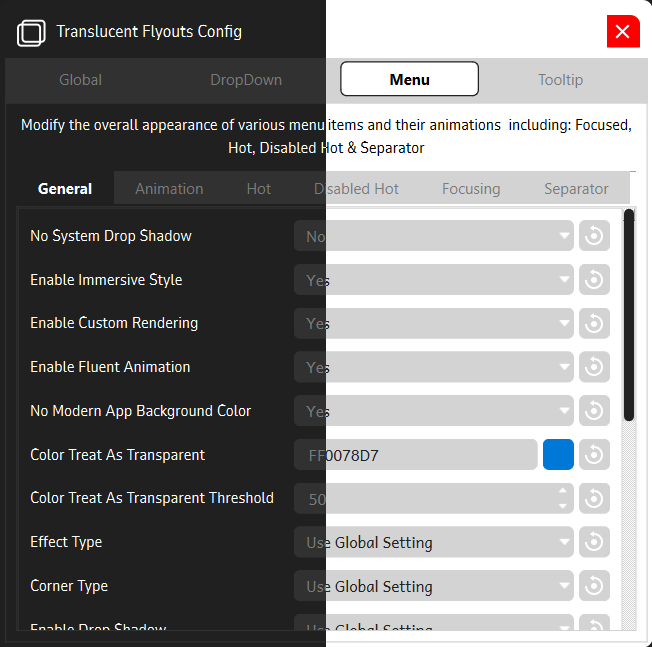

# Translucent Flyouts Config GUI

> Note: This software is in its early stages of development. Bugs are likely to occur but nothing app-breaking.

**Translucent Flyouts Config GUI** is a companion application for [Translucent Flyouts](https://github.com/ALTaleX531/TranslucentFlyouts) for Windows 10/11, which allows various customizations for windows32 style context menus.

<table>
<tr>
<td>
<td>
</tr>
<tr>
<td>
<td>
</tr>
</table>

## Installation Instructions
> Assuming you have the latest release of [Translucent Flyouts](https://github.com/ALTaleX531/TranslucentFlyouts/releases/latest) Installed.
- Download the [latest release](https://github.com/Satanarious/TransparentFlyoutsConfigGUI/releases/latest)
- Extract all files in a directory/folder.
- Run the `TranslucentFlyoutsConfig.exe` file.

## Usage Instructions

- Left-clicking on the reset button on the far right of any setting resets the value to its default value.
- Right-clicking on the reset button on the far right of any setting resets the value to its last-saved value.
- Use the color-picker to choose the color including the alpha(Opacity) value.
- Any changes are immediately applied on pressing the apply button in the respective section.

## Planned Features

Checkout the [tracker](https://github.com/users/Satanarious/projects/2/views/2) for more details on this.

- Translation Support.
- Better Parameter Explanations.
- In-App Themeing Support.
- Translucent Flyouts Internal Function support:
  - Restart
  - Stop
  - Install
  - Uninstall
- UI Animations
- Preview Pane for Instant changes preview before applying
- Download Latest Version of Translucent Flyouts and updates
- Addition to Microsoft Store and/or Winget

## Dependencies

### [TranslucentFlyouts](https://github.com/ALTaleX531/TranslucentFlyouts)

An application that makes most of the win32 popup menus translucent/transparent on Windows 10/11, providing more options to tweak it to meet your need.

### [PyQT6](https://www.riverbankcomputing.com/software/pyqt/)

PyQt is a set of Python bindings for The Qt Company's Qt application framework and runs on all platforms supported by Qt including Windows, macOS, Linux, iOS and Android. Documentations can be found [here](https://doc.qt.io/qtforpython-6/).

### [PyInstaller](https://pyinstaller.org/en/stable/)

PyInstaller bundles a Python application and all its dependencies into a single package. The user can run the packaged app without installing a Python interpreter or any modules. PyInstaller supports Python 3.7 and newer, and correctly bundles many major Python packages such as numpy, matplotlib, PyQt, wxPython, and others.

### [VColorPicker](https://github.com/nlfmt/pyqt-colorpicker)

VColorPicker is a simple visual Color Picker with a modern UI created with Qt to easily get color input from the user.

## Disclaimer

This application contains everything necessary to be known and understood about configuring the appearance of context menus without the need to refer to the previously mentioned Config file.

> Note: This application just serves as a GUI to eliminate any kind of registry editing, required by the previously mentioned application to configure the appearnce of context menus. This is not a standalone application and is required to be used alongside [Translucent Flyouts](https://github.com/ALTaleX531/TranslucentFlyouts)

Take a look at the [Config File](https://github.com/ALTaleX531/TranslucentFlyouts/blob/master/CONFIG.md) which provides description as well as methods to configure various aspects of the windows32 style context menus. Though some features are restricted to Windows 11 due to the absence of Mica on Windows 10.

## License

This software is licensed under the GNU GPL v3.0 License. 
More information is provided in the dedicated [LICENSE](https://github.com/Satanarious/TransparentFlyoutsConfig/blob/master/LICENSE) file.
