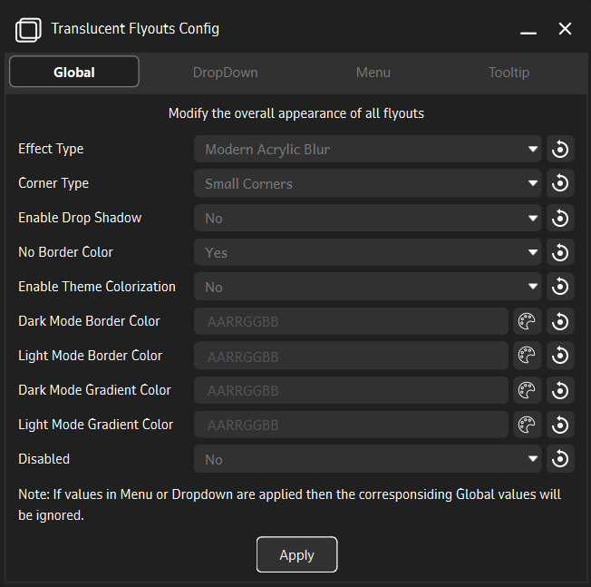
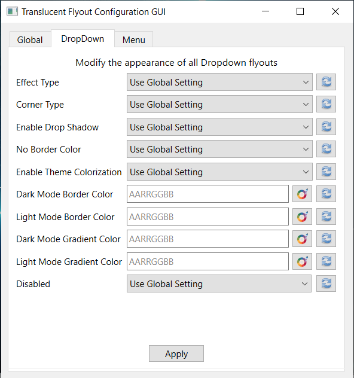
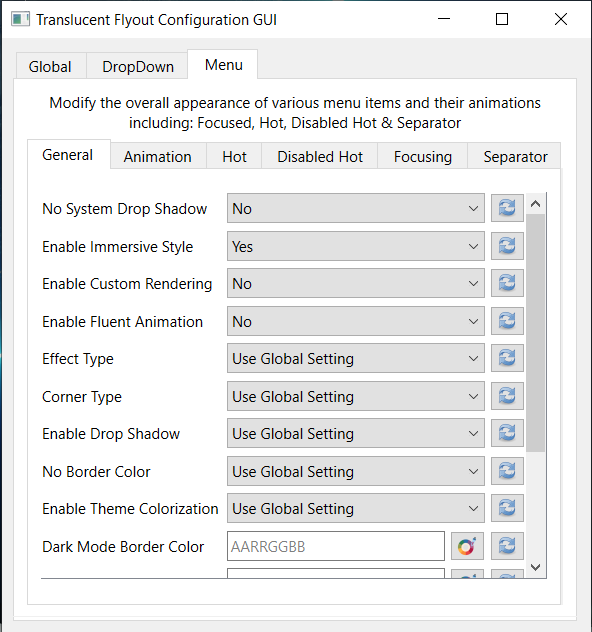

# Translucent Flyouts Config GUI

> Note: This software is in its early stages of development.

**Translucent Flyouts Config GUI** is a companion application for [Translucent Flyouts](https://github.com/ALTaleX531/TranslucentFlyouts) for Windows 10/11, which allows various customizations for windows32 style context menus.

<table>
<tr>
<td>
<td>
<td>
</table>

**Installation Instructions:**

- Download the [latest release](https://github.com/Satanarious/TransparentFlyoutsConfigGUI/releases/latest)
- Extract all files in a directory/folder.
- Run the `TranslucentFlyoutsConfig.exe` file.

**Usage Instructions:**

- Left-clicking on the reset button on the far right of any setting resets the value to its default value.
- Right-clicking on the reset button on the far right of any setting resets the value to its last-saved value.
- Use the color-picker to choose the color including the alpha(Opacity) value.
- Any changes are immediately applied on pressing the apply button in the respective section.

Take a look at the [Config File](https://github.com/ALTaleX531/TranslucentFlyouts/blob/master/CONFIG.md) which provides description as well as methods to configure various aspects of the windows32 style context menus. Though some features are restricted to Windows 11 due to the absence of Mica on Windows 10.

This application contains everything necessary to be known and understood about configuring the appearance of context menus without the need to refer to the previously mentioned Config file.

> Note: This application just serves as a GUI to eliminate any kind of registry editing, required by the previously mentioned application to configure the appearnce of context menus. This is not a standalone application and is required to be used alongside [Translucent Flyouts](https://github.com/ALTaleX531/TranslucentFlyouts)
