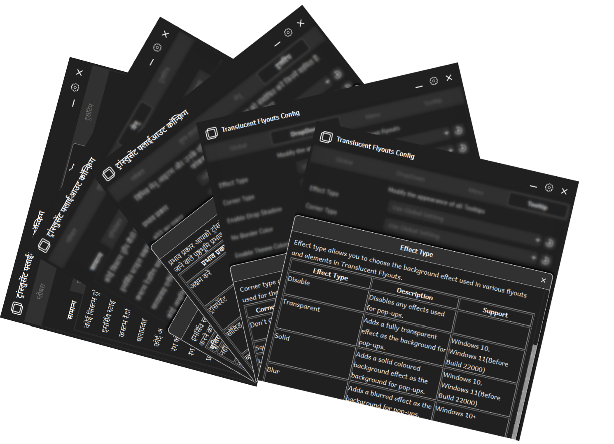
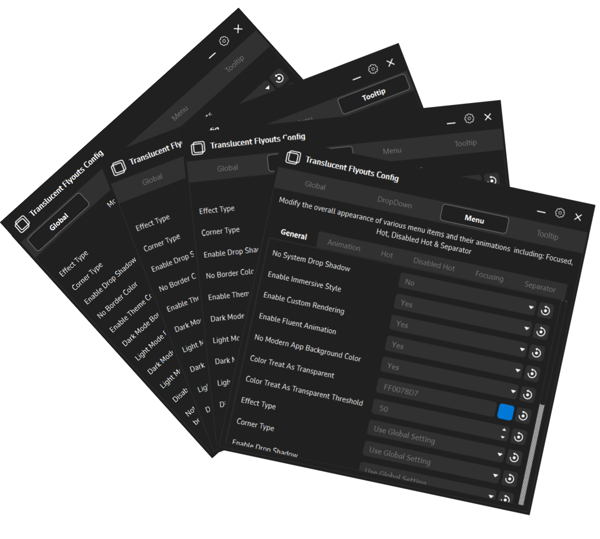
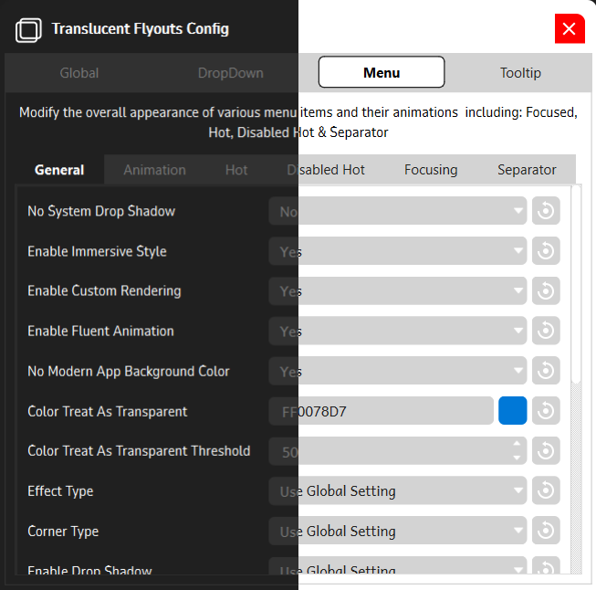

**Translucent Flyouts Config GUI** is a companion application for [Translucent Flyouts](https://github.com/ALTaleX531/TranslucentFlyouts) for Windows 10/11, which allows various customizations for windows32 style context menus.

### Other Languages

- [简体中文](Readme/README-zh_cn.md)

Catalog:

- [Installation Instructions](#installation-instructions)
- [Usage Instructions](#usage-instructions)
- [Translation Contribution](#translation-contribution)
- [Planned Features](#planned-features)
- [Dependencies](#dependencies)
- [Disclaimer](#disclaimer)
- [License](#license)

## Installation Instructions

### 1. 1-Click Install (★ Recommended)

> Note: For old Translucent Flyout users, uninstall the manually installed version of Translucent Flyouts and then follow the underlying steps.
> 

- Download the [latest release](https://github.com/Satanarious/TransparentFlyoutsConfigGUI/releases/latest)
- Extract all files in a directory/folder.
- Run the `TranslucentFlyoutsConfig.exe` file.
- Go to Settings.
- Under External Functions, click the `Download and Install` button

### 2. Manual Install

> Assuming you have the latest release of [Translucent Flyouts](https://github.com/ALTaleX531/TranslucentFlyouts/releases/latest) Installed.

- Download the [latest release](https://github.com/Satanarious/TransparentFlyoutsConfigGUI/releases/latest)
- Extract all files in a directory/folder.
- Run the `TranslucentFlyoutsConfig.exe` file.
- Go to Settings.
- Under General settings, set the path to the installation location of Translucent Flyouts.

## Usage Instructions

- Left-clicking on the reset button on the far right of any setting resets the value to its default value.
- Right-clicking on the reset button on the far right of any setting resets the value to its last-saved value.
- Use the color-picker to choose the color including the alpha(Opacity) value.
- See the avaiable values and their descriptions by click on any parameter label.
- Any changes are immediately applied on pressing the `Apply` or `Save` button in the respective section.
- In the Settings section:
  - Change the app-language in the `General Section` by selecting the language.
  - Change the theme of the application in the `Appearance Section` by selection colors for respective items/backgrounds and more. You can also select from a list of predefined theme presets available just below the color selection.
  - Access functions such as Run, Stop, Install and Uninstall in the `Internal Functions` section.
  - Finally, Download and Install Translucent Flyouts with one click of a button present in the `External Functions` section.

## Translation Contribution

You can contribute to the language of your choice that you are confident in contributing to for this project. You may wanna look at [this](Translations/hi-in.json) translation file before proceeding to contribute.

For first time contributors use the following Steps:

- Fork the Repository.
- Create a file in the [Translations directory](Translations/) using the name convention `LanguageCode-CountryCode.json`, all in lowercase.
- Copy everything from [hi-in.json](Translations/hi-in.json) and paste it into you new file.
- Remove Hindi translations for each corresponding English ones and replace with translation for your respective language.

> Note: There's a translations where a line ends with `<code>` and another that starts with `</code>`, pay close attention and keep it that way in you translation as well, else it will break the code.
> Here are the lines:
>
> - `"Uses the corresponding value in the global tab as the <code>"`
> - `"</code> value."`

If you wanna go a few steps further and edit python, you might as well follow these:

- Open [Data/enum.py](Data/enums.py) and add an additional value to the class ` Languages`.
- Open [Data/paths.py](Data/paths.py) and under class `Translations` add the path to you translation path in the exact as mentioned there for the previously mentioned language(s).
- Open [Data/translations.py](Data/translations.py) and under class `TranslationModel`, under method `_fetch()`, find a dictionary `translationPath` and add another pair in the format `LanguageEnum:LanguageJSONPathVariable`
- Open [main.py](main.py) and under method `__init__` you will find a line which says `self.language` with a list of language names in their own languages. Add one for the one you are adding.

> Note 1: If you just wanna do the first part, I'll accept PR for the same as well and do the 2nd part myself. But the 2nd part would be appreciated.

> Note 2: I'm leaving the font as it is for the unsupported languages for the current fonts. I'll add more fonts later.

## Planned Features

Checkout the [tracker](https://github.com/users/Satanarious/projects/2/views/2) for more details on this.

- [x] Translation Support.
- [x] Better Parameter Explanations.
- [x] In-App Themeing Support.
- [x] Translucent Flyouts Internal Function support:
  - [x] Restart
  - [x] Stop
  - [x] Install
  - [x] Uninstall
- [x] Download Latest Version of Translucent Flyouts.
- [ ] Update to the Latest Version of Translucent Flyouts.
- [ ] Add fonts for supported languages.
- [ ] UI Animations
- [ ] Preview Pane for Instant changes preview before applying.
- [ ] Addition to Microsoft Store and/or Winget.

## Dependencies

### [TranslucentFlyouts](https://github.com/ALTaleX531/TranslucentFlyouts)

An application that makes most of the win32 popup menus translucent/transparent on Windows 10/11, providing more options to tweak it to meet your need.

### [PyQT6](https://www.riverbankcomputing.com/software/pyqt/)

PyQt is a set of Python bindings for The Qt Company's Qt application framework and runs on all platforms supported by Qt including Windows, macOS, Linux, iOS and Android. Documentations can be found [here](https://doc.qt.io/qtforpython-6/).

### [PyInstaller](https://pyinstaller.org/en/stable/)

PyInstaller bundles a Python application and all its dependencies into a single package. The user can run the packaged app without installing a Python interpreter or any modules. PyInstaller supports Python 3.7 and newer, and correctly bundles many major Python packages such as numpy, matplotlib, PyQt, wxPython, and others.

### [VColorPicker](https://github.com/nlfmt/pyqt-colorpicker)

VColorPicker is a simple visual Color Picker with a modern UI created with Qt to easily get color input from the user.

### [Winrar]()

Unrar.exe used in the project is taken from winrar and used to uncompress the files downloaded from TranslucentFlyouts.

### [Tick icon by Freepik - Flaticon](https://www.flaticon.com/free-icons/tick)

The Tick icon included in the application, which appears when the user clicks the apply button is designed by Freepik - Flaticon

## Disclaimer

This application contains everything necessary to be known and understood about configuring the appearance of context menus without the need to refer to the previously mentioned Config file.

> Note: This application just serves as a GUI to eliminate any kind of registry editing, required by the previously mentioned application to configure the appearnce of context menus. This is not a standalone application and is required to be used alongside [Translucent Flyouts](https://github.com/ALTaleX531/TranslucentFlyouts)

Take a look at the [Config File](https://github.com/ALTaleX531/TranslucentFlyouts/blob/master/CONFIG.md) which provides description as well as methods to configure various aspects of the windows32 style context menus. Though some features are restricted to Windows 11 due to the absence of Mica on Windows 10.

## License

This software is licensed under the GNU GPL v3.0 License. 
More information is provided in the dedicated [LICENSE](https://github.com/Satanarious/TransparentFlyoutsConfig/blob/master/LICENSE) file.
